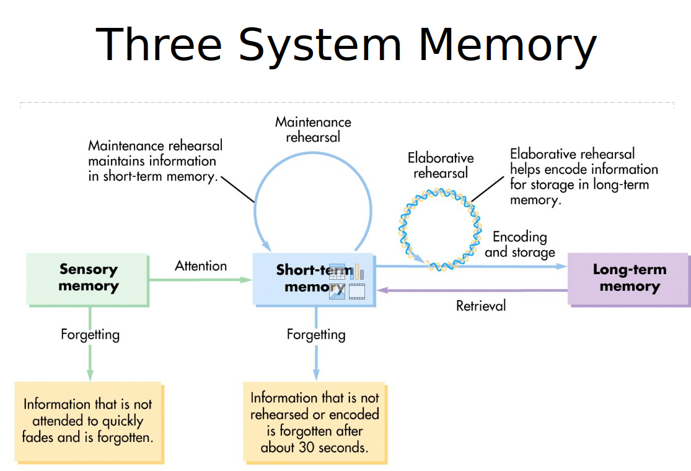
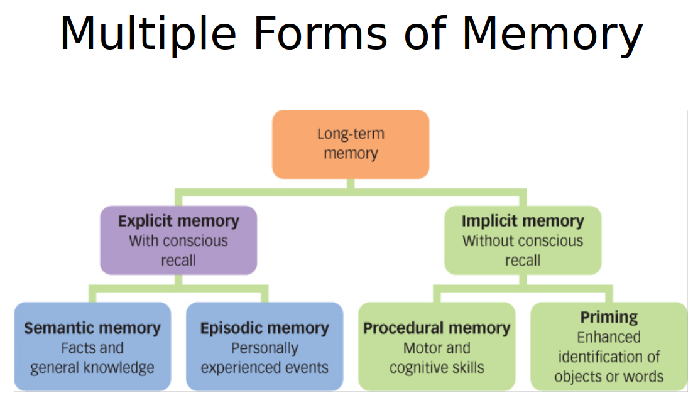
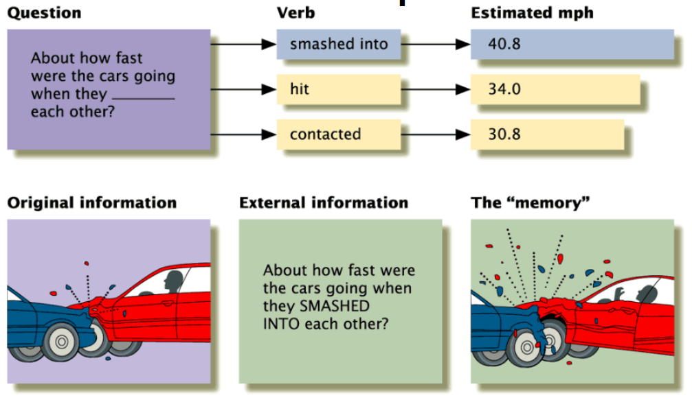

# Memory

## Amnesia

3 Types

- Anterograde (lose ability to make new memories after incident) (memento?)
  - inability to transfer new information from the short-term store into the long-term store
- Retrograde (some/no memory of events before incident) (bourne identity)
  - inability to retrieve information that was acquired before a particular date
- Generalised (rare, kinda both) (memento?)

- Clive Wearing: complete anterograde, limited retrograde.

- Hippocampus acts as in index for LT memory storage

  - Hippocampus removed to prevent seizure => no more LTM

  

- Consolidation: the process by which memories become stable in the brain. Sleep is important for consolidation.
- Reconsolidation: after recall, the memory is vulnerable, and should be consolodated again

- HSAM

## Memory retieval

- Retrieval cues – hints to make retrieval easier

- Encoding specifity: Recall better when retrieval conditions match encoding conditions (external or internal).
  - Context dependant learning: better retrieval when the external context matches that of the learning context (land land, underwater underwater expt)
  - State dependant learning: emotional state, mood etc
- Retrieval of memory may affect other memories positively(testing effect) or adversely(retrieval induced forgetting)

- EXPLICIT (declarative memory): information that we can recall intentionally
- Implicit: unconscious

## Memory failures (7 sins of memory)

1.  Transciance
    - forgetting what occurs with the passage of time
    - Decay: memory fades over time
    - Interference: memories compete with each other
      - Retroactive inhibition: new info blocks old info
      - Proactive (opp. retroactive)
2.  Absentmindedness
    - a lapse in attention that results in memory failure
    - prospective memory : remembering to do things in the future (take medicine at 7pm)
3.  Blocking: 
    - Memory is there, but you cant access it (tip of the tongue phenomenon)
    - Retrieval failure
4.  Memory misattribution
    - assigning a recollection or an idea to the wrong source
    - Source memory: recall of when, where and how info was acquired
      - eg. who was the person who first told about memory misattribution and where did this happen
      - What newspaper did i read it on
    - Cryptomnesia: mistakenly forgot "our" ideas originated elsewhere
    - False recognition (deja vu)
      - feeling of familiarity about something that hasn't been encountered before 
      - same brain activation as true recognition
5.  Suggestibility
    - Tendency to include info from external sources as personal recollection

6. Bias
   - distorting influences of present knowledge, beliefs, and feelings on recollection of previous experiences
   - Consistency bias: reconstruct past to fit the present
   - Change bias: exaggerate the differences between them
   - Egocentric bias: doing the above to make oneself feel better
7. Persistence
   - intrusive recollection of events that we wish we could forget
   - PTSD
   - **Flashbulb memories**: detailed recollections of when and where we heard about shocking events