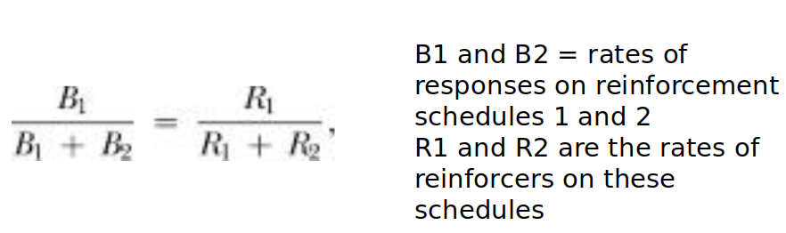
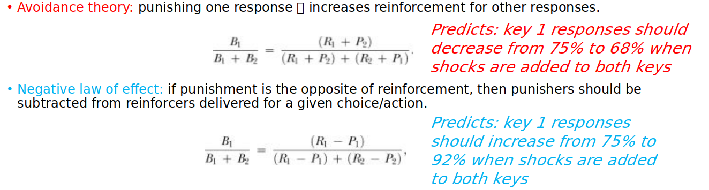
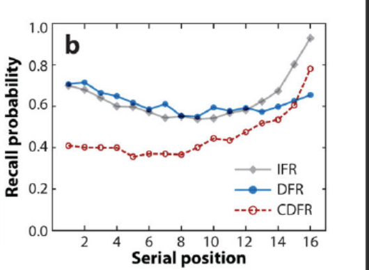
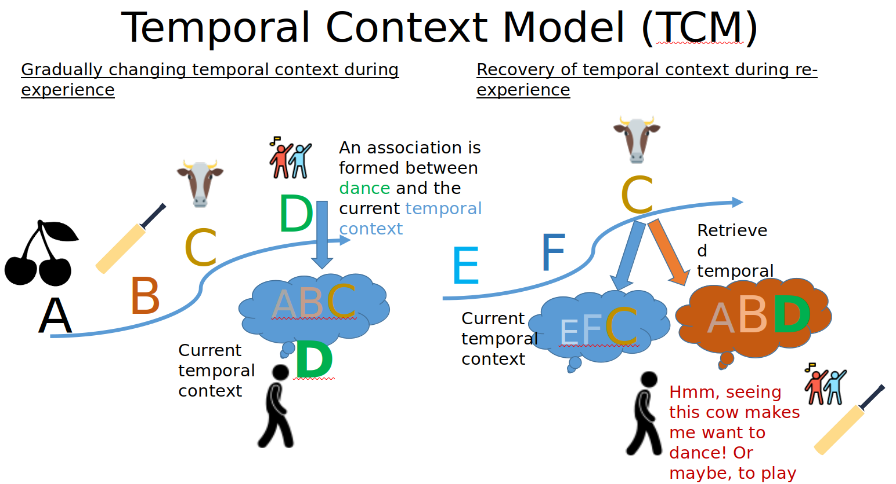
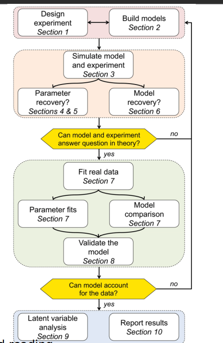
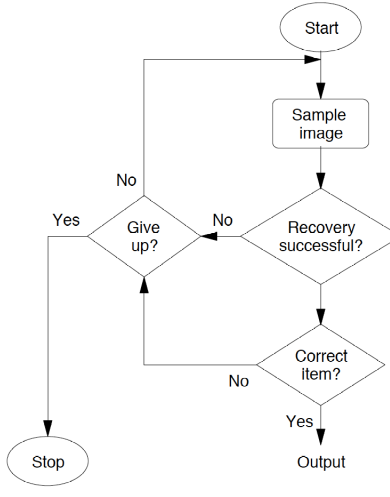

# Mathematical modelling of memory

- Negative law of effect: reinforcement strengthens behaviour whereas punishment weakens behaviour

- Avoidance theory: Punishment induces fear, which is aversive

- Mathematical formulation of the above theories:

  

## Basic memory tasks:

- **Recognition** (was this word in the list shown)
- **Recall** (write down the words)
  - Free recall (as many words as you can)
  - Serial recall (write words in the order in which they appeared in the list)

## Stimulus sampling theory

- situation or context can be represented as a set of elements.
- Each element is mapped to a response (the major response to the stimulus ig)
- A subset of the set of elements is sampled, and the ratio of each response gives the probability of the response being produced.
- explained many phenomena in operant conditioning experiments and also generated new predictions in new situations.

## Temporal Context model (Extension of sampling theory)

- Designed to explain contiguity effect

### Recency effect

- (The letter recall task)
- (IFR) No distractor: high recall of initial (rehearsal) and end letters (recency effect), low recall of middle 
- (DFR) All letters, then distractor (delayed free recall), kinda similar to IFR, but lower recall rates, almost monotonically decreasing (?)
- (CDFR) Continuous-distractor free recall (Letter-math-letter-math...): Similar to IFR, much better recency effect thatn DFR

## Schematic of provcesses involved in using computational model to understand behaviour

## SAM: Search of Associative Memory

- First “global-matching” memory model – i.e., retrieval cues are compared to the entirety of everything in one’s memory to get a memory signal upon which we make memory decisions
- 
