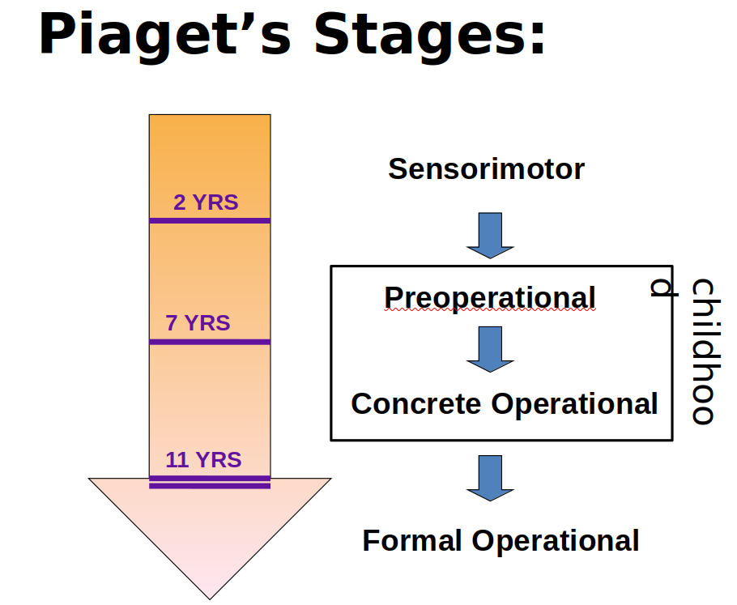
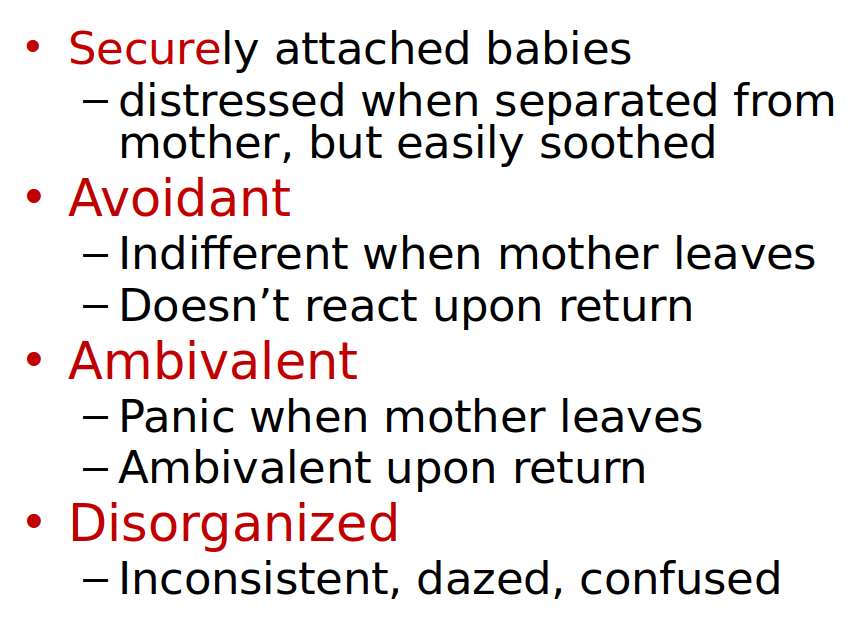

# Development

- Cognitive development: the emergence of the ability to think and understand
  - How the physical world works
  - how their minds represent it
  - how other's mind represent it
- Habituation refers to the decreased responsiveness toward a stimulus after multiple presentations.

- Sensorimotor (0-2)
  - Uses sensory and motor abilities to explore the wold
  - no/incomplete object permanence (Understanding that objects exist even when they are not in view)
-  Preoperational (2-6)
  - symbols to represent ideas
  - cant take other's perspective
  - lacks understanding of conservation (understanding that 2 equal quantities remain equal even if appearance changes) 
- Concrete operational Period (7-11)
  - uses simple logic and mental manipulations, concrete objects only
- Formal operational (12-death)
  - hypothetical reasoning

## Against Piaget's Theory

- It states that child can only be in one stage at a time, but evidences suggest a more continuous dev.
- Overestimated age ranges for each stage
- Too much emphasis on interaction with objs, but not about that with culture.

## Learning from others

- Joint attention: the ability to focus on what another person is focused on
- Social referencing: the ability to use another person’s reactions as information about the world
- Imitation: the ability to do what another person does (or INTENDS to do)

## Attachment

- Imprinting, critical period

- Study on infant attachment to mothers

  

- 