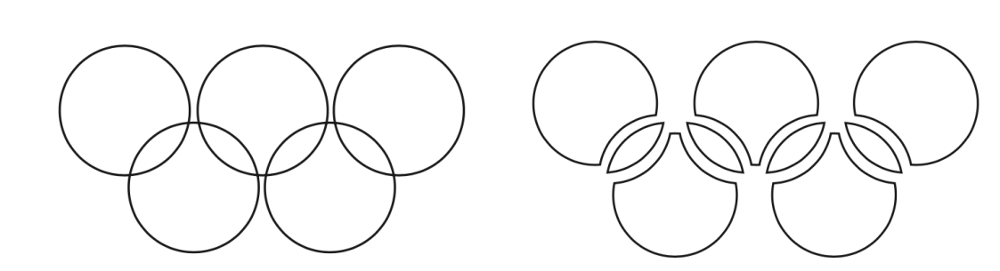
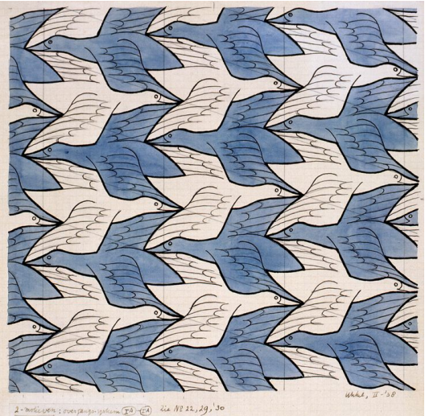
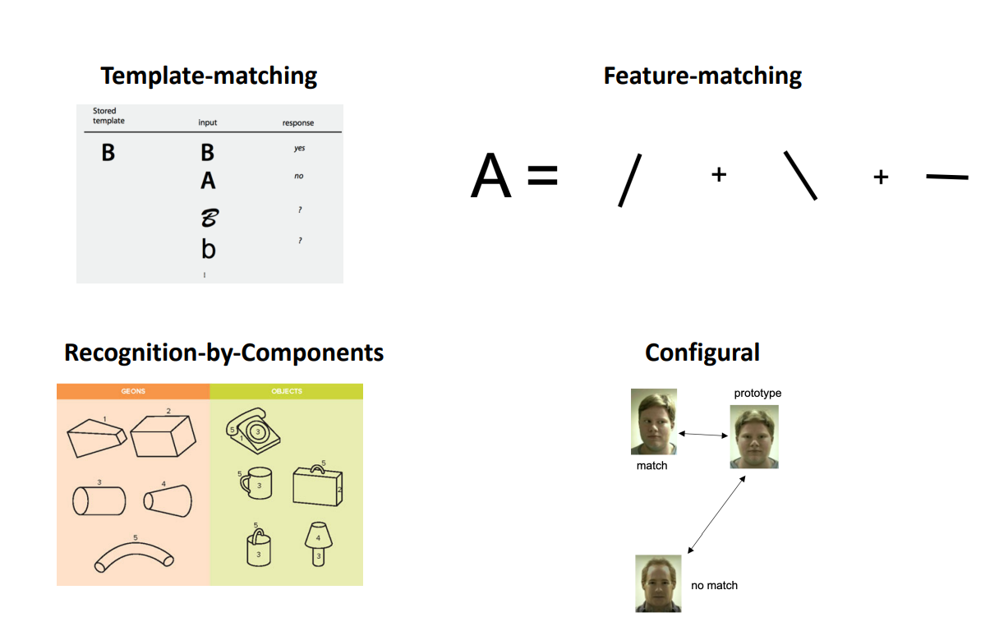
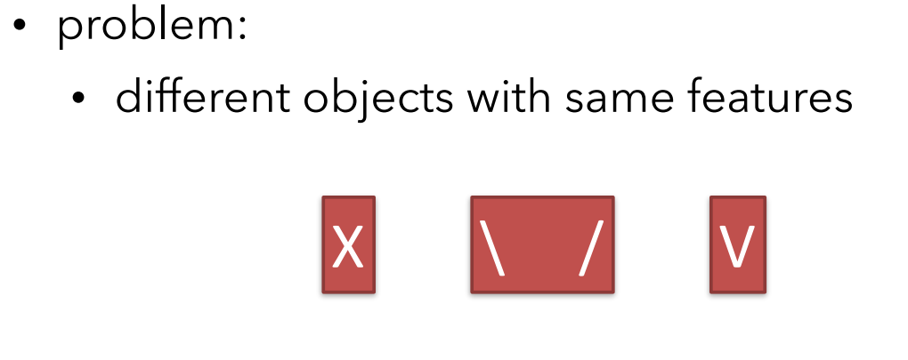
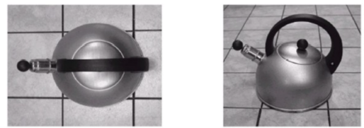

# Lecture 9: 01/09 : Cognition and perception

- our perceptions are the result of unconscious assumptions we make about the environment (Helmholtz theory)
- likelihood principle: states that we perceive the object that is most likely to have caused the pattern of stimuli we have received 

## Gestalt Principles of Organisation

- holistic/gestalt: whole is something else than the sum of its parts.
- Brain has a innate organising tendencies that allow us to perceive things as wholes than individual elements

## Gestalt principles of perceptual organisation

- Says the whole is something else than the sum of its parts

- Principles

  - Pragnanz (good figure/simplicity): perceive and interpret ambiguous or complex images as the simplest form(s) possible

    

    Image perceived as the first, and not the second

  - Similarity

  - Continuation
    - We tend to perceive figures or objects as belonging together if they appear to form a continuous or smooth pattern.

  - Proximity
    - Objects close together in space or time perceived as belonging together
  
  
    - Closure (perceive figures with gaps to be continuous)  
  
  - Figure-ground : Organisation depends on what we see as object and what we perceive as ground (context).
  
    
  
  - Common fate: objects that move together tend to be grouped together

- Not limited to visual domain

- Gestalt laws are heuristics
  - can lead to incorrect perception or error.
- Modern perceptual psychology: perception is shaped by knowledge of regularities in the environment.

- (Topdown and bottom up)

## Models of recognition

### 1. Template matching

- match the whole image to a stored representation of the object
- problem: template typically doesn't account for all possible variations of the obj.

### 2. Feature matching

- Extract important or disc. features (eg edges, colours shape etc) from image and match with known features of obj
- more flexible than template matching - as long as the features are present it will work, even if the object has parts that may be rearranged
- feature detectors: neurons in the cortex that respond best to simple shapes like lines or bars with specific orientations
- feature-matching models may also require less storage space than template models because relatively few features would render recognizable many objects of the same category that are not identical

### 3. Recognition by components

- geons - perceptual building blocks

- if we can recover (see) an object’s geons, we can identify the object

- Problem: 
  - viewpoint invariance is possible (except for some accidental viewpoints).
  
    
  
  - works for recognition of man-made objects, but less clear to natural objects 

### 4. configural model

- obj recognised acc to spatial relations among the shared parts and the extend to which they deviate from the prototype
- damage to fusiform area leads to prosopagnosia

- Expertise hypothesise
  - specialised neural system develops for experts required to judge subtle differences within any particular category 

## Perceptual constancy

- The tendency to perceive objects as maintaining stable properties despite differences in sensory input: distance, viewing angle, and lighting

- Mirror neurons(?)
  - neurons in the premotor cortex respond not just to action but to watching an action
  - audiovisual mirror neurons respond also to sounds that are associated with actions
  - Moebius syndrome
    - Inability to generate facial emotions but can recognise others’ facial emotions
  - cerebral palsy
    - damage to motor system but still perceives and understands others’ actions

  - brocal aphrasia (impairment in speech with spared speech comprehension)

## Perceptual learning

- ong-lasting changes in perception (not belief) that result from practice or experience for adaptation and survival
- improve its ability to respond to its environment and are caused by this environment

## Types of perceptual learning

- Attentional weighting (increasing attention paid to important aspects and by decreasing the attention to irrelevant ones)
  - shifts may be strategic choices
  - categorical perception
- Differentiation 
  - perceive the difference between two properties, where they couldnt perceive the difference before
  - Stimuli that were once psychologically fused together become separated
- Unitization
  - Group things together as a group
  - opposite of differentiation
  - eg: perceive written words as a single unit
- Stimulus imprinting