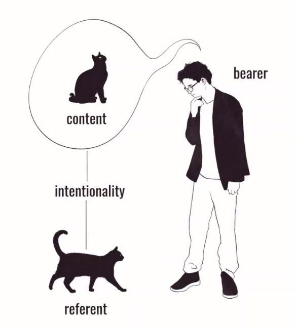
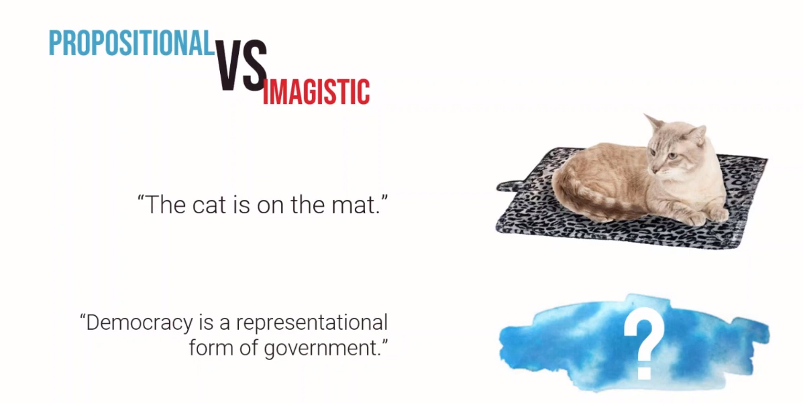

https://plato.stanford.edu/entries/mental-representation/

# Representation

- representation is a pattern of neural activity
- A state or set of states within the brain that act as a “representation of” or a token of something. They relate in some way to the thing being represented and interact with other brain processes in a way that relates to their behaviour.

- we don't have direct access to stuff in the physical world: all we have direct access to are mental representations of the stuff in our head
- This internal mental experience that we have that we use to  construct all the things happening around us is cuz of representations.
- Representations are what give us our experience of reality
- Info from the outside world is represented in the mind: take something from the outside world, translate it into something that makes sense to our brain
  - in this aspect, we are like computers (input -> binary -> decode into output)

## Properties of representation

- referent: The thing that is observed,  which is translated into the representation
- bearer: observer
- content: whatever the information is 
- intentionality: relation b/w referent and content

## Major types of representations

- Imagistic (self explanatory)

  - 
  - Isomorphism: the correspondence b/w the referent and the image (b/w the thing and the image)
  - People without mental imagery exist: Aphantasia (https://www.youtube.com/watch?v=Rp6TfNXbJ4M)

- propositional (form of sentences)

  - can be used instead of imagery, in some situations, imagery is nonsensical
  - Sentence like structure, have a logical structure
  - Things like beliefs or desire

  

  - can also be used to represent logical statements 
  - can be used to visualise relationships

- symbolic (self explanatory)q

  - eg: currency ($)

## Mental rep can also be digital or analog

- digital
  - discreet/categorical
  - prop/symbolic
- analog
  - continuous (?)
  - Imagistic
  - Webers law (ratio)

**Mind is an information processor that performs computations over representations**

# Computational theory of mind

- Neural tissues, synapses, cell assemblies, and a;; the rest are just natures way of building a computing machine- Andy Clark
- mind is a computer

# Representational theory of mind

- here to refer to any theory that postulates the existence of semantically evaluable mental objects like thoughts, concepts, percepts, ideas, impressions, notions, rules, schemas, images, phantasms, etc. – as well as the various sorts of “subpersonal” representations postulated by cognitive science
- Starting point: commonsense mental states like thoughts, belief, desires, perceptions and images.
  - These states are said to have intentionality: they refer to things, may be evaluated with respect to properties like consistency, truth, appropriateness and accuracy.
  - intentional mental states -> relations to mental representations
    - Eg: the belief that Gandhi is dead is related to a mental representation whose content is that Gandhi is dead (feelings that the fear, the sorrow, regret that he is dead etc are all related to the same representation)
- RTM also understands mental processes such as thinking, reasoning and imagining as sequences of intentional mental states.

## Representation and phenomenalism

-  Representationalists claim that the phenomenal content of a non-conceptual representation – i.e. , its phenomenal character – is reducible to a kind of intentional content, naturalistically construed . On this view, phenomenal contents are extrinsic properties represented by non-conceptual representations. (basically, the representation made from the extrinsic properties is used to derive phenomenal content).
  - representationalist thesis is often formulated as the claim that phenomenal properties are representational or intentional.
- In contrast, phenomenalists claim that the phenomenal content of a non-conceptual mental representation is identical to its intrinsic phenomenal properties.

# Content determination

- how does mental representations come to have their contents.
- Two basic types of contemporary naturalistic theories of content-determination : *causal-informational* and *functional*

## Causal information 

- hold that the content of a mental representation is grounded in the information it carries about what *does* or *would* cause the encoding of the representation to occur.
- Widely disregarded: A mental representation can be caused by something it does not represent, and can represent something that has not caused it (telephone ringing can represent information, not the physical bell), whereas nothing can be caused by something that doesn’t cause it.

ur best scientific theories postulate Turing-style computation over mental representations.

Representation (incl aspects of representation, explain)

human behaviour is computational

why representation is needed for computation ??

can we explain memory using representation

Kinds of representation

Intro to CTM

how behaviours are affected by CTM

Linguistics ft. arjun

