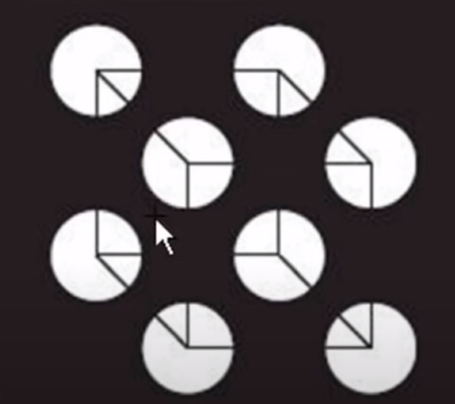
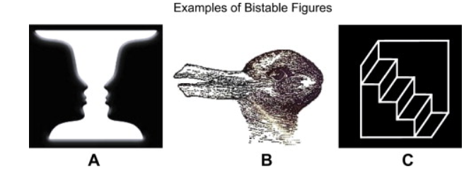
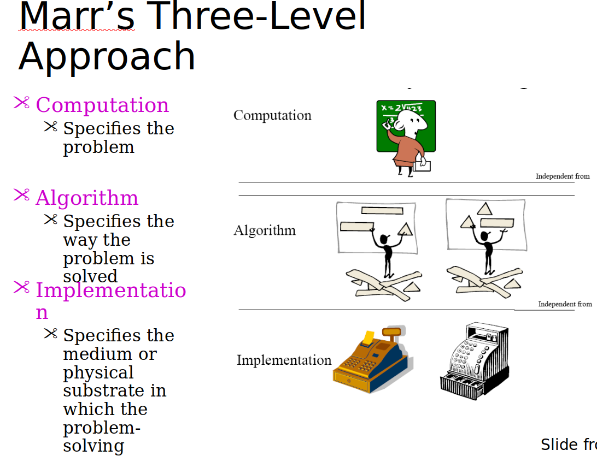

# Lecture 1

## Top-down processing

- Top-down processing is defined as the development of pattern recognition through the use of contextual information

- Our prior experiences (background knowledge) influences perception.

- In the figure above, we perceive that there's a cube even though there actually arent lines connecting the corners, as we expect a cube to be present.
- Theory driven.
- Goal oriented

## Bottom Up processing

- In the bottom-up processing approach, perception starts at the sensory input, the stimulus. 
- Stimulus influences our perception.
- Start with no preconceived idea of what we are looking at, allow stimulus to influence our perception
- Data driven
- Not goal driven

In where's waldo, if we use:

- Bottom up: we only see a bunch of people
- Top down: We try to find waldo (goal)

## Bistable perception

- Sometimes the same stimuli can be perceived in multiple ways

- Bistable perception occurs because the stimuli offers several interpretation possibilities that cannot be perceived simultaneously or because its features may be ambiguous to uniquely interpret.
- Once we find multiple interpretations of the stimuli, we may switch back and forth between the interpretations.

## Bayesian brain

- Aka predictive brain
- Ideal sensory system should combine top-down and bottom up processing (combine prior knowledge and current observation).
- It suggests optimal ways of understanding and interpreting data. It also takes into account future possibilities, and uses these optimal ways to make decisions. 

## Thorndike's experiment

- Put a cat in a puzzle box
- Apparent cleverness arises by trial and error
- If an action brings a reward, it gets imprinted to the brain.
- Behaviour changes because of its consequences.

