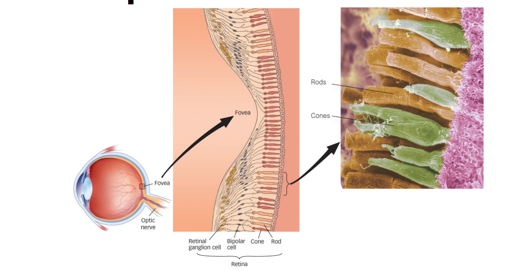
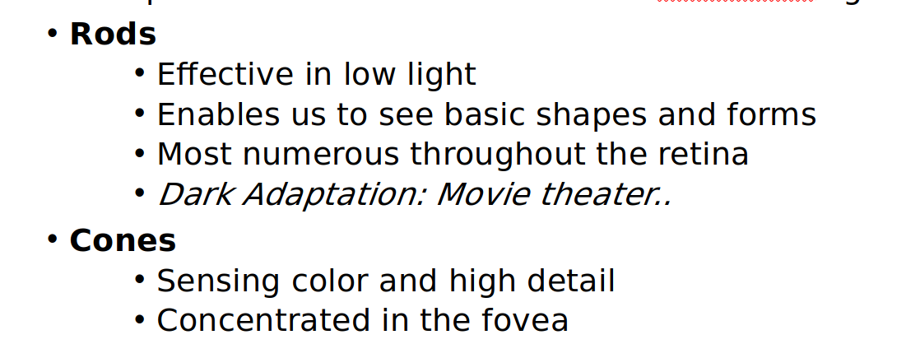
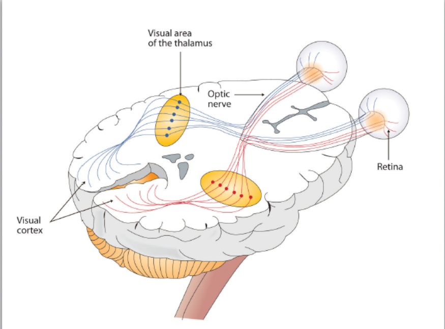
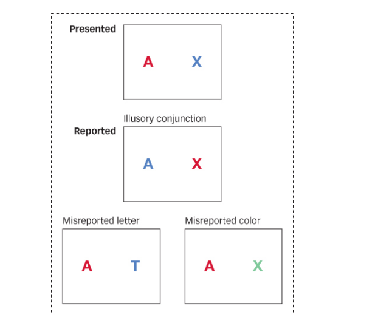
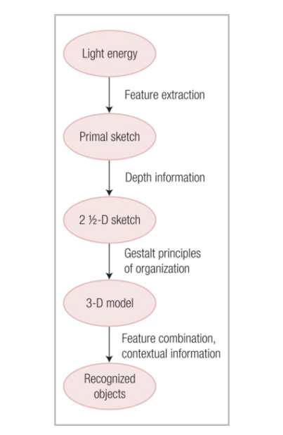

# Lecture 10: 05/09

# Vision

- huge brain area dedicated to vision (back part)
- (colour)pigment mixing
- Two types colour mixing:
  - Additive mixing
    -  Additive color mixing is creating a new color by a process that adds one set of wavelengths to another set of wavelengths
    - Additive color mixing is what happens when lights of different wavelengths are mixed
  - Subtractive mixing
    - Subtractive color mixing is creating a new color by the removal of wavelengths from a light with a broad spectrum of wavelengths.
    - Subtractive color mixing occurs when we mix paints, dyes, or pigments.

## Eye

Cornea -> pupil -> lens -> retina

### Sclera

-  white part

### Iris:

- Large coloured part, control pupil size

### Pupil

- Aperture

### Optic nerve

- Collection of axons of the retinal nerves

- The fovea centralis, or fovea, is **a small depression within the neurosensory retina where visual acuity is the highest** (lotta cone cells only, no rods)
- Blind spot: no rods no cones

- Axons of the bundled up ganglion cells constitute the optic nerve, some axons go to the visual cortex

- Fovea: in charge of acuity (sharpness) of image

- Fovea: only 5 photoreceptors input to the ganglion cells, high resolution
- Both eyes send info to both parts of the brain
  - Nasal region of the eye sends info to the same side hemisphere.

## Colour perception

- Two theories: trichromatic colour rep, and color opponent rep.

### 1. Trichromatic Theory

- RGB
- Cones of each type in retina
- Can be used to explain colour blindness

### 2. Color opponent representation

- Pairs of opponent color cells (R/G , B/Y..)

- Can explain the concept of afterimage (opposite color image can be perceived)

  

- **McCullogh effect** : colorless gratings appear colored contingent on the orientation of the gratings.
- Peripheral vision

  - It’s what allows you to see objects all around you without turning your head or moving your eyes. It helps you to sense motion and walk without crashing into things. It’s what you use to see something "out of the corner of your eye."
- different components and senses integrated into a single perception- the **binding problem**.
- Illusory conjunction (unsuccessful  binding of visual perceptions)

  
- Feature integration theory: attention is not needed to perceive individual things, but needed to integrate them
- Change blindness: when people fail to detect changes to the visual details of a scene
- Inattentional blindness: a failure to perceive objects that are not the focus of attention 
- Motion blindness :Inability to perceive moving objects
- Visual agnosia: can see fine, can make out shapes, but cant perceive objects

- Object recognition models (ref Lec 9)

## Beiderman's recognition

- Parts of the larger object are recognized as subobjects
- Subobjects are categorized into types of geons – geometric ions.
- Only edges/contours and contour junctions are needed to recognize geons.
- Pros
  - Can address occlusion, noisy environments, view invariance, etc.
  - Only a small set of 36 geons necessary.
- Cons
  - Can address bigger discrimination problems such as aircraft vs automobile but discriminating between categories with very similar features (e.g. different bird species) requires more than just geons. 

## Marrs theory for vision

