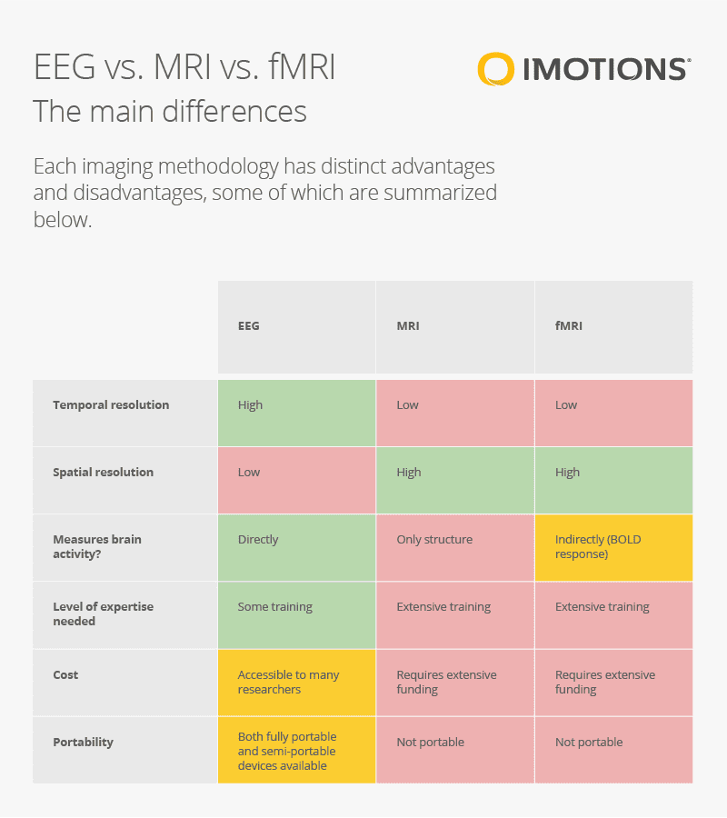

# Lecture 4: 08/08/22

## 2 Types of research

- Theory driven
  - Theory-driven research is a more traditional approach of conducting scientific inquiry that starts with developing hypotheses, followed by collecting and analysing data to test these hypotheses and drawing theoretical conclusions based on the results.
- Exploratory
  - We collect data in some setting, then apply correlational analysis to understand a possible conclusion that the correlation formed could lead to, construct a hypothesis, test this new hypothesis and loop through until a solid theory is built. This gives us insight into new possible theories we couldn’t have come across otherwise.

## 2 Modes of research:

- Behavioral
  - Observational methods based on an organism’s response to stimulus
  - Psychophysics etc.	
  
- Neural
  - Analysing brain signals on performing certain actions or responding to stimuli
  - EEG, IMRI etc.

## Psychophysics

Involves measurement of perceptions by individuals. 

- field of psychology that studies the relationship between physical stimuli and the sensations and perceptions they produce. Essentially, we ask people questions to know their response to the stimulus and then study this.
- There are three typical methods of measuring perception in psychophysics:
  - Magnitude estimation – e.g. rate on a scale of 1-10 how bright was this spot on the screen/ How loud was this tone?
  - Matching – e.g. Increase the brightness of the dull spot to match the brightness of the other spot.
  - Detection or discrimination – e.g. Which of the two spots is brighter? Which tones of the series of tones did you hear?

Psychophysics also involves methods that measure the strength of a stimulus and the observer’s sensitivity to that stimulus.

## Weber's law

- d(I)/I = k
- Stronger the baseline stimulus, the bigger the change required to detect a difference
- eg: 2 small lines differing in length can be distinguished easily, while longer ones need a bigger difference to clearly distinguish.
- Not a real law, since we cant explain the phenomena using this law, its only a description about the observation/phenomenon.

## Signal detection theory

- Signal detection in a noisy environment depends on person's sensitivity to the stimulus _and_ their response to the signal.

> **Working memory**: there are 2 schools of thoughts:
>
> - limited set of discrete, fixed resolution
> - pool of resources
>
> An example of how to test is by showing n color boxes, and then hide them and make a person use a color palette to recreate the color in a certain block.

## Neural investigations in cogsci

### EEG (Electrical Encephalography)

- Measures electrical activity of the brain using electrodes placed in the scalp
- good temporal resolution, bad spatial resolution (since the electrodes measure activity near the surface, it is difficult to know whether the signal came from near the surface or from a deeper region).

### MRI (Mag. resonance imaging)

- MRI provides a map of the brain - how it looks at a set moment in time
- Identify tumours
- gives us only a static image which cannot help us understand brain activity.

### fMRI (Functional MRI)

- It works on the same principle as MRI, but instead measures how the amount of oxygenated blood in a certain region of the brain changes after a particular action.
- poor temporal resolution, good spatial resolution
- Oxygenated and deoxygenated blood cells have different mag. property: basis of mri and related scans.
- also called BOLD fMRI (Blood Oxygen Level Dependent fMRI).
- (pro: )FMRI is a good tool to check signals from hippocampus (FMRI has better spatial resolution).
- (con: )FMRI has low temporal resolution (6-8 s lag).

