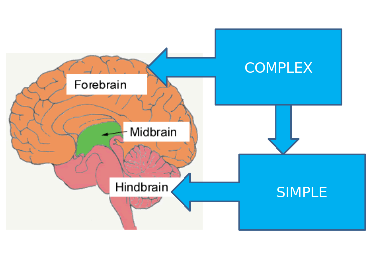

# Lecture 6: 18/08

- Prof Vinoo Alluri

# Sensory systems and sensation

## Types of neurons:

- Sensory neuron
- motor neuron 
- interneurons (connect the above 2)

## Parts of neuron

- Cell body:
  - Aka Soma
  - Keeps the neuron alive
  - Contain nucleus
- Axon
  - Sending information
  - Action potential
- Axon terminal
  - Knob like structures: terminal buttons
  - Synaptic vesicles: contain neurotransmitter

- Myelin sheath
  - Insulating fat layer
  - Speeds up signal transfer
  - Nodes of ranvier: gaps in myelin sheath, also speeds up signals
- Synapse:
  - Fluid filled space b/w ending of one neuron and start of another
  - Synaptic cleft: space b/w 2 neurons, where the fluid gets released to 
  - Synaptic vesicles: sacs contain neurotransmitters

- resting potential (no neurotransmitters acting) of neuron: -70 mV
- Neural communication:
  - Within neuron: Electrical, by action potential
  - B/w neurons: Chemical, by neurotransmitters

## Thalamus

- control center for sensory info
- relay center

## Hypothalamus

- intermediary b/w nervous and endocrine system (hormone)
- control center for autonomic nervous system (reflex/instinct)
- regulates instinct

 

## Neurotransmitters

### Glutamate

- excitatory, learning and mem
- memory enhancer

### GABA (Gamma aminobutyric acid)

- inhibitory (alcohol, anxiety)

### Acetylcholine

- voluntary motor control
- attention, learning, sleeping, dreaming, memory
- Alzheimers

### Dopamine

- Regulates motor behavior, motivation, pleasure, emotional arousal
- Too much: schizophrenia, too little: parkinsons

### norepinephrine

- influence mood and arousal
- Heightened awareness of dangers in the env. (stage fright)

### Caffeine

- When your brain is tired and wants to slow down, it releases a chemical called adenosine (an inhibitory neurotransmitter ).
- Caffeine mimics adenosine; so it can “plug up” your receptors and prevent adenosine from getting through.

