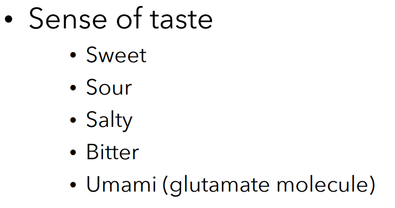
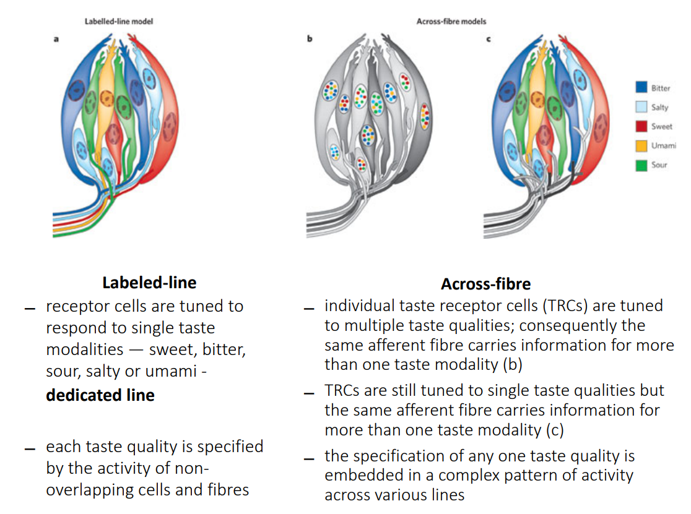

# Lecture 7: 22/08

## Theories of sound encoding in cochlea

## 1. Volley theory

- Synch. of several adj neurons encodes periodicity info.
- groups of neurons of the auditory system respond to a sound by firing action potentials slightly out of phase with one another so that when combined, a greater frequency of sound can be encoded and sent to the brain to be analyzed.

## 2. Temporal coding theory (?)

- frequency encoded in timing of neural firings along the basilar membrane

## 3. Place theory

- encoded at different places on the basilar membrane

## Hearing sensitivity

- most sensitive to 1kHz - 5kHz range
- phons: Unit of perceptual amplitude.
- (Loudness contour curves): used in volume control

## Critical bands of hearing

- Higher sensitivity in lower frequencies (easier to distinguish 20 HZ difference in 600-620, not at 6000-6020).

- Ability to dist. b/w different tones vary as a function of freq.

## Pitch

- Mel scale: Perceptual scale of pitches judged by listeners to be equal in distance from each other
  - In lower frequencies: almost linear
  - higher: exponential.
- In this scale, the diff b/w 1000 and 2000 is 1000 mels(say), then the diff b/w 2000 and 4000 (perceived same) will also be 1000 mels, 4000 and 8k would be 1000 mels and so on.

## Timbre

- Timbre is associated with selective hearing: focus on one auditory signal and filtering out the others
- Tritone paradox(?)
- Shepard tone illusion (?)

- Auditory hallucinations: perceive sounds without auditory stimulation
  - Abnormal activation of regular perceptors
  - esp in schizophrenics.
  - Increased blood flow in Broca's area in schizophrenics, ie, its not just that theyre perceiving sounds, somthing actually happens (?)
- can also be caused due to sensory deprivations (sailors)

## Tinnitus

- Ringing sound (can be caused by excessive use of headphones)
- Treatment
  - Sound treatment (white noise etc.)
  - healthy lifestyle
  - auditory exercises

## Hearing loss

1. Conductive hearing loss: Problems in transmitting sound waves to the cochlea

2. Sensorineural Hearing Loss: Caused by damage to inner ear or auditory nerve

--- End of Auditory system ---

# Olfaction

- Chemoreceptors (present in nasal cavity) detects odour molecules in our food and environment
- send input to olfactory bulb in forebrain
- **olfactory system is the only human sense that bypasses the thalamus and connects directly to the forebrain**
- each receptor sensitive to specific compounds, each odor activates a different pattern of glomeruli

# Gustation

- Umami: Deliciousness (jap) - savoury/pleasant taste
- each taste bud has taste receptor cells for molecules of all 5 taste qualities 

- Supertaster: Have greater bitter taste sense

