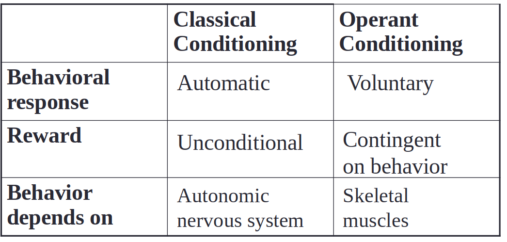

# Learning

## Classical conditioning

- Pairing a neutral stimulus with another that elicits a reflex
- the neutral stimulus begins to elicit the reflex after many trials
- Dog salivating when bell is rung, dwight mint prank
- **Unconditioned stimulus** : a stimulus that elicits an automatic, reflexive response (the meat piece for dog), not learnt
- **Unconditioned response**: the reflex action to a stimulus, also not trained (salivating) 
- **Conditioned Stimulus**: the bell
- **Conditioned response**: dog thinks that he'll get the meat when bell is rung, and starts salivating
- Phases of CC
  - Aquisition: Gradual learning of CR (salivation) thru pairings of CS (metronome) and UCS (meat)
  - Extinction: CR stops when CS is presented alone enough times 
- Spontaneous recovery: sudden reemergence of an extinct CR after a delay in exposure to the CS
- Renewal effect: the tendency of an extinct CR to return when the organism is placed in the original conditioning environment
- Stimulus generalisation: More similar a stimulus is to the CS, stronger will be the response
- When multiple neutral stimuli are present (music with the bell?) response will be better if all the stimuli are used
- Fear conditioning: Phobias may result from such stimuli (experiment with a boy named Albert in which he paired a white rat with a loud, startling noise. Albert now becomes startled at the sight of the white rat.)

## Operant conditioning

- Thorndike's law: If response produced to  stimulus is positive, then there is a positive binding b/w the response and the stimulus
- **Reinforcement**: to promote a behaviour
  - Positive reinforcement: Add a positive stimulus
  - Negative: remove a negative stimulus (take away reward)
    - an undesirable stimulus is removed to increase a behavior. For example, car manufacturers use the principles of negative reinforcement in their seatbelt systems, which go “beep, beep, beep” until you fasten your seatbelt.
- **Punishment**: To weaken a response or behaviour
  - Positive: Add a negative stimulus (eg: beating)
  - Negative: Take away a positive stimulus (No more ps5)
  - Tells what NOT to do instead of what to do
  - Creates anxiety
  - May encourage sneakiness to lie or avoid
  - May encourage aggressive behavior 

## Schedules of reinforcing

- Continuous reinforcements (every occurence is rewarded)

- Partial reinforcement (only some are rewarded)

- Schedules can vary on two dimensions:

  - Consistency: fixed or variable

  - Basis 

    - Ratio 

      - Fixed
        - same no. of desired responses needed
        - Rapid response rate with short pauses
      - Variable
        - number of responses required varies for each event
        - Rapid rate without pauses

    - Interval (Number of responses compared to amount of time elapsed since last reinforcement)

      - Fixed
        - same time before reinforcement opportunity
        - Long pauses
      - Variable
        - Reinforcement possibilities after varying amounts of time
        - slow, steady rate without pauses

      

      

## SOR Model

- Stimulus-Organism response model
- Organism's interpretation of stimulus is also important

## Latent learning

- (Rat in a maze) rats who are never reinforced also forms a mental map of the maze (cog. maps are a challenge to radical behaviourism)
- Latent learning: learning that isn’t directly observable (reinforcements are not always needed to learn)

## Observational learning

- as name suggests, learning by watching others do the thing
- Saves us from life threatening mistakes, but can lead to bad habits if you learn from the wrong models
- **Diffusion chain**: a process in which individuals initially learn a behaviour by observing another individual perform that behaviour, and then serve as a model from which other individuals learn the behaviour.
- Mirror neurons (same neurons fire when you watch an action or do it yourself) , in prefrontal cortex

